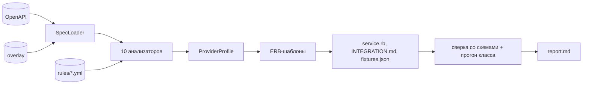

# specgen — генератор интеграций с платёжными провайдерами

Инструмент на Ruby, который принимает OpenAPI-спецификацию платёжного
провайдера и собирает из неё готовую интеграцию для Space Payments: сервис по
контракту `Provider::BaseService`, документацию, фикстуры и отчёт о том, что в
спецификации неоднозначно.

Это компилятор, а не интеграция с одним провайдером. Спецификация превращается
в нейтральную модель провайдера, из модели по шаблонам собираются артефакты.
Всё, что выводится формально, выводится по открытым стандартам (ISO 4217,
OpenAPI Overlay 1.0.0, JSON Schema, Standard Webhooks, IETF Idempotency-Key).
Всё, что формально не выводится, попадает в отчёт, а не угадывается молча.

Хакатон Hack.Genesis 2026, кейс 1 (Space Payments), команда «Два килобайта».

## Быстрый старт

### С Докером: ничего ставить не нужно

```sh
docker build -t specgen .
docker compose run --rm api ./integrate --spec provider_api.yaml --provider novapay --lang ruby
```

Артефакты появятся в `output/` на вашей машине: `docker-compose.yml`
монтирует этот каталог. Веб-интерфейс тем же образом:

```sh
docker compose up --build        # http://localhost:9292
```

### Без Докера

Нужны Ruby 3.2 или новее и Bundler.

```sh
bundle install
./integrate --spec provider_api.yaml --provider novapay --lang ruby
```

`provider_api.yaml` — файл из описания кейса, он лежит в корне репозитория.
Ожидаемый вывод:

```
Разбор спецификации... provider_api.yaml: OpenAPI 3.0.3, 5 операций, 8 схем, 31 поле
  POST /payouts, GET /payouts/{payout_id}, POST /payouts/{payout_id}/cancel, ...
Авторизация: ApiKeyAuth -> api_key, заголовок X-API-Key, ключи credentials: api_key
Вебхук: /webhooks/payout, подпись X-NovaPay-Signature (hmac_sha256)
Генерация сервиса... ok (448 строк) -> output/novapay_service.rb
Генерация документации... ok (243 строки) -> output/INTEGRATION.md
Генерация фикстур... ok (472 строки) -> output/fixtures.json
Генерация отчёта... ok (301 строка) -> output/report.md
Прогон собранного класса: проверок 37, прошло 37, не прошло 0
Предупреждения: 18 (0 ошибок, 6 предупреждений, 12 справок); подробности — ./integrate analyze --spec provider_api.yaml
```

Сначала инструмент говорит, что он в спецификации увидел, потом пишет четыре
файла, исполняет сгенерированный класс на его же фикстурах и заканчивает
строкой о предупреждениях. Проверить результат:

```sh
ruby -c output/novapay_service.rb                                              # Syntax OK
bundle exec rubocop --config config/rubocop_generated.yml output/*_service.rb  # no offenses
ruby -rjson -e 'JSON.parse(File.read("output/fixtures.json")); puts "JSON OK"'
grep -c '^## ' output/report.md         # 7 разделов
grep -c '^## ' output/INTEGRATION.md    # 9 разделов
```

### Windows

В PowerShell вместо `./integrate` пишите `ruby integrate`, в Git Bash работает
`./integrate`. Нужен RubyInstaller **с DevKit (MSYS2)**: RuboCop и
`json_schemer` тянут нативные расширения, и без компилятора `bundle install`
не пройдёт. Все команды этого README проверены в PowerShell, Git Bash и в
Докере.

## Что получается на выходе

| Файл | Что внутри | Как проверить | Пример |
|---|---|---|---|
| `<provider>_service.rb` | класс по контракту `Provider::BaseService`: `check_conditions`, `create_request`, `fetch_status`, `process_callback`, плюс отдельные методы для операций вне контракта; таблицы `STATUS_MAP`, `ERROR_MAP`, `RETRY_POLICY`, `EVENT_MAP`; проверка подписи вебхука с константным сравнением; ключ идемпотентности UUID v5 | `ruby -c`, RuboCop, прогон класса в `report.md` §1 | [examples/novapay/novapay_service.rb](examples/novapay/novapay_service.rb) |
| `INTEGRATION.md` | девять разделов: авторизация и хранение секрета, переменные окружения, таблица методов, статусы и события, ошибки с действиями, параметры подключения, схема подписи, подключение по шагам, принятые допущения | девять заголовков `##` | [examples/novapay/INTEGRATION.md](examples/novapay/INTEGRATION.md) |
| `fixtures.json` | примеры запросов (по одному на операцию, с заголовками), ответов (на каждый объявленный код) и уведомлений (на каждое событие плюс две негативные) с настоящей HMAC-подписью; у каждой фикстуры `expected` и `source` | `JSON.parse`; сверка со схемами спецификации в `report.md` §1 | [examples/novapay/fixtures.json](examples/novapay/fixtures.json) |
| `report.md` | семь разделов: сводка и результаты проверок, покрытие двумя цифрами и непокрытое по причинам, неоднозначности с готовыми фрагментами OpenAPI Overlay, операции вне контракта, противоречия самой спецификации, справки, чеклист ручной работы | семь заголовков `##` | [examples/novapay/report.md](examples/novapay/report.md) |

Флаг `--fix` пишет пятый файл `<provider>.overlay.yaml` — заготовку
переопределений, по закомментированному слоту на каждую неоднозначность.

В `examples/` лежит результат генерации по всем десяти спецификациям
каталога; CI сверяет его с повторной генерацией.

## Десять спецификаций одной командой

```sh
./integrate --all
```

```
Спецификация                  Провайдер           Операций  С ролью  Покрытие  В контракте  Замечаний  Файлов
broken.yaml                   broken              6         5/6      43 %      65 %         64         4
cardpay.yaml                  cardpay             6         6/6      66 %      94 %         42         4
depositbank.yaml              depositbank         6         4/6      60 %      87 %         43         4
novapay.yaml                  novapay             5         5/5      75 %      98 %         18         4
real/adyen_payout_v68.yaml    adyen_payout_v68    6         2/6      23 %      45 %         216        4
real/adyen_transfers_v4.yaml  adyen_transfers_v4  12        7/12     32 %      74 %         377        4
real/govuk_pay_v1.json        govuk_pay_v1        16        10/16    36 %      89 %         203        4
real/moov_paygate_v1.yaml     moov_paygate_v1     10        7/10     56 %      79 %         55         4
real/paypal_payouts_v1.json   paypal_payouts_v1   4         4/4      34 %      72 %         88         4
real/paystack_v1.yaml         paystack_v1         120       59/120   51 %      69 %         469        4
Итого: 10 спецификаций, сгенерировано 10 из 10
Медиана колонки «В контракте»: 76.5 % — половина спецификаций разобрана в границах контракта лучше этой цифры
```

Четыре спецификации свои: выданная `novapay`, `cardpay` (выплата на карту,
Bearer, Standard Webhooks, другие имена статусов), `depositbank` (депозиты
вместо выплат, OpenAPI 3.1 с `dependentRequired`, JPY с нулевой экспонентой,
без вебхуков) и `broken` (одиннадцать намеренных дыр, пронумерованных в
шапке файла, — на каждую в `report.md` есть строка, и генерация не
блокируется). Шесть настоящих чужих, с открытыми лицензиями: Adyen Payout и
Transfers, PayPal Payouts, Paystack, GOV.UK Pay, Moov — источники и что в
каждой интересного в [spec/fixtures/specs/real/README.md](spec/fixtures/specs/real/README.md).

Покрытие у чужих ниже, и это честная цифра: их спецификации в разы шире
задачи выплат (подписки, споры, планы). Вторая колонка считает то же в
границах контракта — без того, чему в четырёх методах `Provider::BaseService`
нет места по построению, — и всё вычтенное названо в разделе 2 отчёта.

Разбор без генерации, с обоснованием каждого вывода:

```sh
./integrate analyze --spec spec/fixtures/specs/novapay.yaml --explain
```

```
Единицы суммы: minor, x100 (ISO 4217: экспонента RUB 2); валюта RUB (задано явно 1.00)
    = type: integer -> минорные единицы; описание подтверждает: "копейках"; minimum 100000 = 1000.00 RUB
Статусы: 5 сопоставлено, 0 не выведено
  pending     -> in_progress (по справочнику 1.00)
  POST /payouts                     create_payout  0.95  createPayout
      = композитное сопоставление: operation_id 5.0, path_tail 3.0, path_resource 2.0, http_method 2.0, tag 1.0, request_body 1.0 = 14.0 из 14.0 поданных голосов; следующая cancel 7.5
```

Рядом с каждым значением стоит источник («задано явно», «по справочнику»,
«эвристика») и уверенность, под каждым исправимым предупреждением — готовый
фрагмент OpenAPI Overlay.

## Сравнение двух версий спецификации

Провайдер обновил API — инструмент показывает, что изменилось для
интеграции, сравнивая две промежуточные модели, а не текст файлов:

```sh
./integrate diff --old spec/fixtures/specs/novapay.yaml --new spec/fixtures/good/novapay_v2.yaml
```

```
Сравнение: novapay.yaml -> novapay_v2.yaml

Операции
  операция появилась: retryPayout  меняет сгенерированный сервис
      $.paths['/payouts/{payout_id}/retry'].post

Статусы
  статус появился: succeeded = approved  меняет сгенерированный сервис
      $.components.schemas.PayoutResponse.properties.status.enum[2]
  статус исчез: completed = approved  меняет сгенерированный сервис
      $.components.schemas.PayoutResponse.properties.status.enum[2]

Коды ошибок
  правило появилось: recipient_blocked = reject  меняет сгенерированный сервис
      $.components.schemas.PayoutError.properties.code.enum[7]

Вебхуки
  заголовок подписи: X-NovaPay-Signature -> X-Signature  меняет сгенерированный сервис
      $.paths['/webhooks/payout'].post.parameters[0]
  ...

Изменений: 10, из них меняют сервис: 10
```

Сравниваются значения промежуточной модели, поэтому переименование
заголовка подписи даёт три изменения, а не одно: вместе с именем перестали
выводиться кодировка и подписываемое тело — профиль из справочника больше не
совпадает. Флаг `--strict` возвращает код 1, если хоть одно изменение меняет
сгенерированный сервис; та же спецификация против себя даёт «Изменений нет».

## Веб-интерфейс

```sh
cd space-payments-dashboard && pnpm install && pnpm build && cd ..
cp -r space-payments-dashboard/out/. public/
ruby bin/serve --port 9292      # http://localhost:9292
```

Или `docker compose up --build`: образ собирает фронт сам. Тот же конвейер
за экраном: каталог спецификаций, загрузка своего файла, четыре артефакта с
отрендеренным Markdown, предупреждения, сводная таблица. Один процесс отдаёт
и API, и статику; без собранного фронта работает только API.

| Маршрут | Что делает |
|---|---|
| `GET /api/health` | версия и язык |
| `GET /api/specs` | каталог спецификаций из `spec/fixtures/specs/` |
| `POST /api/analyze` | разбор по `spec_id` из каталога или по тексту `content` (до 5 МБ); необязательные `provider`, `locale`, `overlay` |
| `POST /api/generate` | генерация: содержимое четырёх артефактов и сводка — числа, покрытие, три уровня доверия в числах, допущения |
| `GET /api/batch` | та же таблица, что печатает `--all` |

## Как это работает

```
SpecLoader → OverlayApplier → Analyzers (+ Matchers) → IR → Generators → Validators → Reporter
```



Загрузчик читает YAML или JSON, применяет OpenAPI Overlay, разрешает `$ref`
и размыкает циклы. Десять независимых анализаторов заполняют промежуточную
модель, где каждое выведенное значение помечено источником, уверенностью и
обоснованием. Генераторы собирают артефакты из ERB-шаблонов, проверки
сверяют фикстуры со схемами спецификации и исполняют сгенерированный класс
на этих фикстурах, отчёт печатает всё, что не вывелось. Подробно, с
диаграммами и описанием каждого файла — [docs/ARCHITECTURE.md](docs/ARCHITECTURE.md).

Три уровня доверия ([docs/PRINCIPLES.md](docs/PRINCIPLES.md)):

1. **Формальная структура спецификации** (`required`, `enum`, `pattern`,
   `securitySchemes`, `dependentRequired`) — используется молча.
2. **Справочники и структурные эвристики** (ISO 4217, словари синонимов,
   роли эндпоинтов по методу, пути и тегу) — используются с пометкой
   источника и уверенности.
3. **Не вывелось или низкая уверенность** — берётся лучший кандидат, но с
   предупреждением в `report.md`, `TODO` в коде и слотом в overlay.
   Генерация не блокируется никогда.

Ядро работает не с именами полей, а с шестнадцатью ролями платёжной
области; сопоставление «имя → роль» делает композитный матчер (COMA, Rahm &
Bernstein 2001) по словарю, типу, ограничениям и структуре. В `lib/` нет ни
одной провайдер-специфичной строки — это проверяется в CI:

```sh
grep -rinE 'novapay|\bsbp\b' lib/     # пусто
```

## Как добавить нового провайдера

Строками в справочниках, а не кодом. Провайдер называет статус `sending`,
которого у нас не было:

```sh
./integrate --spec new_provider.yaml --provider acme
# report.md: «статус sending не найден ни в каноне, ни среди синонимов
#             rules/statuses.yml; выберите внутренний статус в overlay или
#             добавьте синоним в справочник»
```

Одна строка в `rules/statuses.yml`:

```yaml
synonyms:
  in_progress:
    - sending
```

и повторный прогон читает статус молча. Так же добавляются имена полей
(`rules/roles.yml`), лексика операций (`rules/operations.yml`), политика
кодов ошибок (`rules/errors.yml`), профили подписи (`rules/signatures.yml`),
схемы авторизации (`rules/auth.yml`), алиасы заголовка идемпотентности.

Второй путь — не трогая репозиторий: `report.md` печатает готовые фрагменты
OpenAPI Overlay 1.0.0, а `--fix` собирает их в файл.

```sh
./integrate --spec provider_api.yaml --provider novapay --fix     # пятый файл: output/novapay.overlay.yaml
# снять комментарий с нужного слота
./integrate --spec provider_api.yaml --provider novapay --overlay output/novapay.overlay.yaml
```

На выданной спецификации это видно так: условная обязательность `bank_code`
при `type=sbp` высказана прозой, читается с уверенностью 0.50 и даёт
предупреждение. Слот из заготовки превращает её в `dependentRequired` с
уверенностью 1.00, предупреждений становится меньше, а в сгенерированном
коде меняется комментарий над полем. Отчёт и overlay — один механизм.

## Команды и флаги

| Команда / флаг | Назначение |
|---|---|
| `generate` | генерация артефактов, команда по умолчанию |
| `analyze` | разбор без генерации: что инструмент понял в спецификации |
| `diff` | отличия двух версий спецификации, важные для интеграции |
| `--spec FILE` | путь к OpenAPI-спецификации (YAML или JSON) |
| `--provider NAME` | имя провайдера; по умолчанию выводится из `info.title` |
| `--lang ruby` | целевой язык, поддерживается только `ruby` |
| `--overlay FILE` | OpenAPI Overlay 1.0.0 с ручными переопределениями |
| `--output DIR` | каталог результата, по умолчанию `output/` |
| `--fix` | записать пятым файлом `<provider>.overlay.yaml` — заготовку переопределений |
| `--all` | прогнать все спецификации каталога и напечатать сводку |
| `--specs DIR` | каталог для `--all`, по умолчанию `spec/fixtures/specs` |
| `--explain` | у `analyze`: обоснование под каждым выведенным значением |
| `--old FILE`, `--new FILE` | у `diff`: две версии спецификации |
| `--locale ru\|en` | язык вывода (или `SPECGEN_LOCALE`) |
| `--strict` | код возврата 1, если есть предупреждения (у `diff` — если есть изменения, меняющие сервис) |
| `version` | версия генератора |

Коды возврата: `0` успех, `1` ошибка генерации или `--strict`, `2` неверное
использование. Всё, что печатает инструмент, по умолчанию по-русски;
`--locale en` переключает и консоль, и сгенерированные документы. Справка
`--help` читается при загрузке класса, поэтому следует переменной
`SPECGEN_LOCALE`, а не флагу.

## Тесты и качество

```sh
bundle exec rspec           # 1108 примеров
bundle exec rubocop         # 348 файлов, тот же конфиг применяется к сгенерированному коду
bundle exec rspec spec/golden   # четыре артефакта novapay байт-в-байт против эталона
ruby bin/ruby-share         # доля Ruby: 96.8 % (с ERB 97.8 %)
```

Тесты покрывают генератор, а не сгенерированный сервис: по каталогу на
стадию в `spec/unit/`, 17 видов плохого входа в `spec/fixtures/bad/`,
golden-эталон в `spec/fixtures/golden/`. CI (GitHub Actions, Ruby 3.2 и 3.4)
прогоняет RuboCop и RSpec, пакетный прогон по всем спецификациям, `ruby -c`
и RuboCop на каждом сгенерированном сервисе, разбор каждого `fixtures.json`,
повторный прогон с `diff -r` как доказательство детерминированности,
сверку `examples/` с перегенерацией и grep провайдер-нейтральности `lib/`.

## Честные ограничения

- **Контракт `Provider::BaseService` — допущение.** Реального класса
  платформы нет; контракт смоделирован по примеру из описания кейса и
  подтверждён экспертами как несущественный. Записан в
  [docs/ASSUMPTIONS.md](docs/ASSUMPTIONS.md) и в разделе «Принятые допущения»
  каждого `INTEGRATION.md`; машинный источник — `rules/contract.yml`.
- **Живого трафика к провайдеру нет.** Сгенерированный класс исполняется на
  своих фикстурах с подменой платформы и клиента; это доказывает
  правильность запроса, но не поведение реального провайдера.
  Мок-провайдер как отдельный сервер не делался: эксперты сказали, что
  оценивают класс, а не трафик.
- **Покрытие на чужих спецификациях 23–59 %.** Их API в разы шире задачи;
  вторая цифра «в границах контракта» и список вычтенного — в разделе 2
  каждого отчёта.
- **Заготовка `--fix` приходит закомментированной целиком.** Overlay
  читается как первый уровень доверия, и вписать в него свою догадку живой
  строкой значило бы выдать её за факт.
- **Только `--lang ruby`.** Сетевые `$ref` не разрешаются намеренно; спецификации
  размера Stripe (6 МБ, тысячи повторных `$ref`) не помещаются в память
  после разворачивания — сообщение внятное, стектрейса нет.

## Соответствие правилам хакатона

| Требование | Как соблюдаем |
|---|---|
| Без нейросетей в прототипе | только справочники, регулярные выражения, строковые метрики, эвристики по структуре; ни одного сетевого вызова в рантайме |
| Ruby больше 50 % кода | 96.8 % (с ERB 97.8 %) по правилам GitHub Linguist, проверяется `bin/ruby-share`; фронт — оболочка, вся логика в Ruby |
| Только открытый код | все зависимости с открытыми лицензиями, список в [DEPENDENCIES.md](DEPENDENCIES.md) |
| Без секретов | сгенерированный код читает ключи из `provider.credentials` или `ENV.fetch`, в фикстурах только заглушки, номера карт только тестовые |

## Сверх требований кейса

- **Круг «отчёт → `--fix` → `--overlay`»**: инструмент не только называет
  неоднозначности, но и пишет заготовку решения в формате открытого
  стандарта OpenAPI Overlay 1.0.0.
- **Прогон собранного класса**: сгенерированный сервис исполняется на своих
  фикстурах, итог — в консоли и в `report.md`.
- **`diff` двух версий спецификации** через промежуточную модель.
- **Две цифры покрытия** и непокрытое поимённо с причиной.
- **Пакетный прогон `--all`** с медианой по каталогу.
- **`analyze --explain`**: арифметика голосов под каждым решением.
- **Два языка вывода**, новый — каталог в `locales/` без правки кода.
- **Корпус из 33 публичных спецификаций** (3177 операций), по которому
  замерены словари ролей и статусов; шесть чужих спецификаций в тестах.
- **Веб-интерфейс** над тем же конвейером и Docker-образ.

## Документация

- [docs/ARCHITECTURE.md](docs/ARCHITECTURE.md) — конвейер, диаграммы, что лежит в каждом файле
- [docs/PRINCIPLES.md](docs/PRINCIPLES.md) — три уровня доверия, роли, контракт, правила кода
- [docs/CONCEPT.md](docs/CONCEPT.md) — почему решение устроено именно так и на какие стандарты опирается
- [docs/IR.md](docs/IR.md) — промежуточное представление
- [docs/STATUS.md](docs/STATUS.md) — состояние каждой стадии, соглашения, что осознанно не сделано
- [docs/RUBRIC.md](docs/RUBRIC.md) — критерии оценки → артефакт → как проверить
- [docs/ASSUMPTIONS.md](docs/ASSUMPTIONS.md) — принятые допущения
- [docs/QUESTIONS.md](docs/QUESTIONS.md) — вопросы экспертам и дословные ответы
- [docs/IDEAS.md](docs/IDEAS.md) — идеи сверх кейса и их состояние
- [docs/GLOSSARY.md](docs/GLOSSARY.md) — термины
- [docs/CHECKPOINT-1.md](docs/CHECKPOINT-1.md), [CHECKPOINT-2](docs/CHECKPOINT-2.md), [CHECKPOINT-3](docs/CHECKPOINT-3.md) — итоги трёх встреч с экспертами, слайды в `docs/checkpoint-*/`
- [DEPENDENCIES.md](DEPENDENCIES.md) — зависимости, версии, лицензии
- [examples/](examples/) — сгенерированные артефакты по десяти спецификациям

## Лицензия

MIT, см. [LICENSE](LICENSE).
