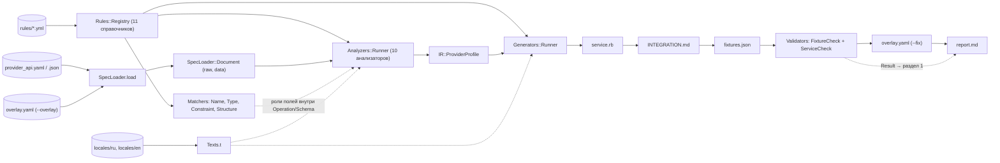
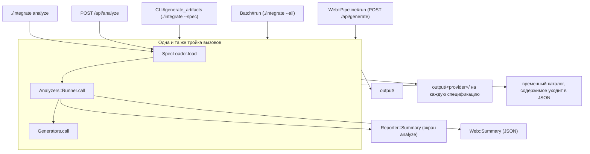
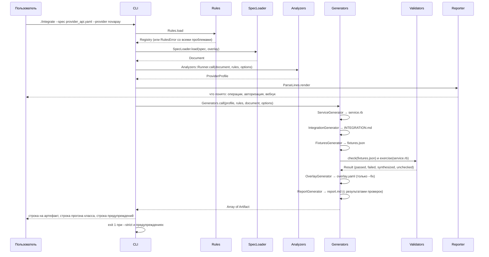
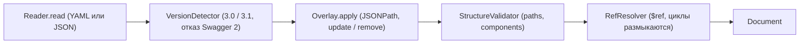
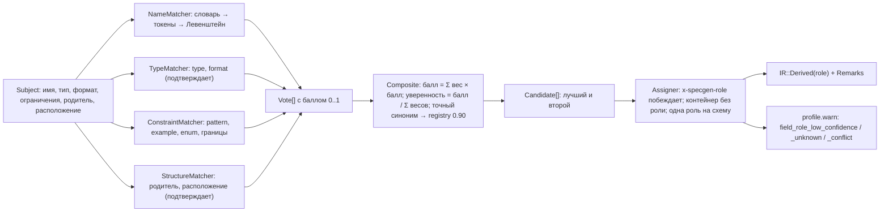
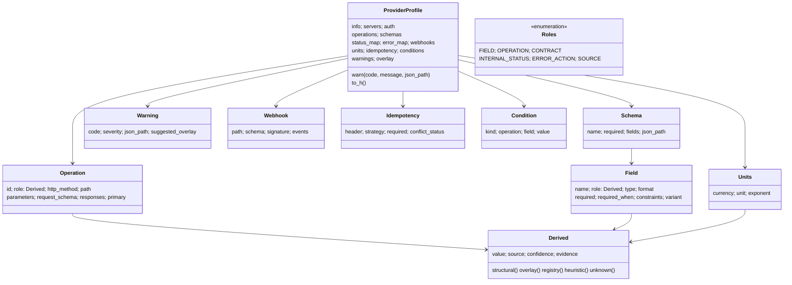
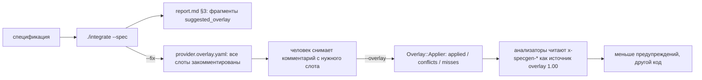

# Архитектура

Как устроен генератор: конвейер, точки входа, промежуточная модель,
справочники и что лежит в каждом каталоге. Принципы, по которым всё это
построено, — `docs/PRINCIPLES.md`; почему выбраны именно они —
`docs/CONCEPT.md`; состояние каждой стадии и способ её проверить —
`docs/STATUS.md`.

Конвейер одной строкой:

```
SpecLoader → OverlayApplier → Analyzers (+ Matchers) → IR → Generators → Validators → Reporter
```

## 1. Конвейер



| Стадия | Каталог | Точка входа | Вход → выход | Тесты |
|---|---|---|---|---|
| SpecLoader | `lib/specgen/spec_loader/` | `SpecLoader.load(path, overlay:)` | путь к файлу → `Document` (сырой и разрешённый документ, версия, циклы `$ref`) | `spec/unit/specgen/spec_loader/`, `spec/fixtures/bad/` |
| OverlayApplier | `lib/specgen/overlay/` | `Overlay.apply(raw, file:)` внутри загрузчика | сырой документ → тот же документ с применёнными действиями + `Overlay::Result` | `spec/unit/specgen/overlay/` |
| Rules | `lib/specgen/rules/` | `Rules.load` → `Rules::Registry` | `rules/*.yml` → одиннадцать книг, сверенных между собой | `spec/unit/specgen/rules/` |
| Analyzers | `lib/specgen/analyzers/` | `Analyzers::Runner.call(document:, rules:, options:)` | `Document` → `IR::ProviderProfile` | `spec/unit/specgen/analyzers/` |
| Matchers | `lib/specgen/matchers/` | `Matchers::Assigner.new(rules:).call(subjects)` | поля одной схемы → роли с обоснованием | `spec/unit/specgen/matchers/` |
| IR | `lib/specgen/ir/` | `IR::ProviderProfile` | нейтральная модель провайдера | `spec/unit/specgen/ir/` |
| Generators | `lib/specgen/generators/` | `Generators.call(profile:, rules:, document:, options:)` | профиль → `Array<Artifact>` на диске | `spec/unit/specgen/generators/`, `spec/golden/` |
| Validators | `lib/specgen/validators/` | `Validators.check`, `Validators.exercise` | записанные артефакты → `Validators::Result` | `spec/unit/specgen/validators/` |
| Reporter | `lib/specgen/reporter/` | `Reporter::Summary`, `ParseLines`, `BatchLines`, `DiffLines` | профиль → текст для консоли | `spec/unit/specgen/reporter/` |
| Diff | `lib/specgen/diff/` | `Diff.new(old, new).call` | два профиля → список изменений | `spec/unit/specgen/diff_spec.rb` |
| Web | `lib/specgen/web/` | `Web.app` через `config.ru`, `bin/serve` | HTTP-запрос → те же три вызова конвейера | `spec/unit/specgen/web/` |

## 2. Три точки входа — одни и те же три вызова



Три места зовут одну и ту же последовательность: `CLI#generate_artifacts`
(`lib/specgen/cli.rb`), `Batch#run` (`lib/specgen/batch.rb`) и
`Web::Pipeline#run` (`lib/specgen/web/pipeline.rb`). Команда `analyze` и
маршрут `/api/analyze` останавливаются после второго вызова. Веб пишет
артефакты во временный каталог и читает их обратно с диска, поэтому байты в
ответе API равны байтам, которые пишет CLI.

## 3. Один прогон `generate`



## 4. Загрузчик и overlay



Overlay применяется до разрешения `$ref`: его цели адресуют спецификацию как
написано, и `$.components.schemas.X` должен быть одним местом, а не копиями,
которые резолвер разнёс по документу. Проверка структуры идёт после overlay:
конвейер обязан увидеть тот документ, который получится, иначе overlay мог
бы протащить схему с опечаткой мимо проверки. Битый overlay — ошибка с
именем файла и местом (`OverlayError`); цель, которой нет в спецификации, —
предупреждение `overlay_target_missing`, остальные действия применяются.
Подмножество JSONPath у целей — ровно то, что печатает отчёт: корень, имя
через точку, ключ в скобках, индекс массива.

## 5. Анализаторы

Каждый анализатор наследует `Analyzers::Base`, получает `document`,
`profile`, `rules`, `options` и заполняет свою часть профиля. Анализаторы
независимы: ни один не читает то, что записал другой; всё общее — в
reader'ах, пересчитываемых от документа. Порядок в `Runner::ORDER`
фиксирован ради воспроизводимости, а не из-за зависимостей.

| # | Анализатор | Заполняет | Общие reader'ы | Примеры предупреждений |
|---|---|---|---|---|
| 1 | `InfoAnalyzer` | `info`, `servers` | `EnvironmentDetector` | `provider_name_unknown` |
| 2 | `AuthAnalyzer` | `auth` | `AuthScheme`, `SecurityRequirements`, `rules/auth.yml` | `auth_scheme_unsupported` |
| 3 | `OperationAnalyzer` | `operations` | `OperationRole`, `RoleVeto`, `OperationPairing`, `ParameterReader`, `Matchers::Assigner` | `operation_id_missing`, `operation_unmapped`, `operation_role_ambiguous` |
| 4 | `SchemaAnalyzer` | `schemas` | `SchemaIndex`, `SchemaNormalizer`, `SchemaReader`, `ConstraintReader`, `Matchers::Assigner` | `field_role_low_confidence`, `required_field_role_unknown`, `field_role_conflict` |
| 5 | `UnitsAnalyzer` | `units` | `RoleLookup`, `UnitReader`, `CurrencyReader`, `rules/currencies.yml` | `units_unknown`, `units_inconsistent`, `currency_unknown` |
| 6 | `StatusAnalyzer` | `status_map` | `StatusReader`, `ExampleReader`, `rules/statuses.yml` | `status_unmapped`, `status_missing_from_enum` |
| 7 | `ErrorAnalyzer` | `error_map` | `ErrorCodeReader`, `HttpErrorRules`, `DedupReader`, `rules/errors.yml` | `error_code_undeclared`, `error_code_unused`, `undeclared_status_code` |
| 8 | `WebhookAnalyzer` | `webhooks` | `WebhookEvents`, `SignatureReader`, `rules/signatures.yml` | `signature_profile_incomplete`, `webhook_event_undeclared` |
| 9 | `IdempotencyAnalyzer` | `idempotency` | `DedupReader`, `rules/idempotency.yml` | `idempotency_header_ambiguous` |
| 10 | `ConditionsAnalyzer` | `conditions` | `ConditionReader`, `NegatedBranch`, `rules/conditions.yml` | `conditional_required_hint`, `condition_unclear` |

Первым, до анализаторов, `Runner` зовёт `document.overlay.warn_into(profile)`:
только стадия overlay знает, что стояло в спецификации до слияния, поэтому
предупреждения `overlay_conflict` пишет она, а не анализатор.

## 6. Матчеры: как поле получает роль



Опознают роль только имя и ограничения; тип и расположение лишь
подтверждают уже опознанную — иначе каждое строковое поле под `recipient`
получало бы пять кандидатов с равным баллом. Веса (name 5, constraint 4,
structure 4, type 1), порог 0.6, отрыв 0.1 и потолок 0.95 лежат в секции
`matchers` `rules/roles.yml`; загрузчик отказывает, если один матчер в
одиночку достигает порога. Порог решает не «присваивать ли роль», а
«попадёт ли решение в отчёт»: лучший кандидат получает роль всегда, ниже
порога — с предупреждением и TODO в коде.

Роли операций считаются отдельной системой того же устройства:
`Analyzers::OperationRole` голосует признаками `operationId`, хвост пути,
отсутствие авторизации, ресурс, HTTP-метод, тег, наличие тела (веса в
`rules/operations.yml`), после чего `RoleVeto` отсекает роли по форме, а
`OperationPairing` связывает операцию создания с операцией опроса статуса.

## 7. Промежуточная модель



Каждый выведенный член — `IR::Derived`: значение вместе с источником
(`structural`, `overlay`, `registry`, `heuristic`, `unknown`), уверенностью и
строкой обоснования, которую печатает отчёт. Экземпляры заморожены:
анализатор заменяет `Derived`, а не правит его. `to_h` возвращает члены в
порядке объявления — на этом стоят golden-тесты. Подробно — `docs/IR.md`.

## 8. Генераторы

`Generators::Runner::ORDER` = `ServiceGenerator`, `IntegrationGenerator`,
`FixturesGenerator`, `OverlayGenerator` (только по `--fix`),
`ReportGenerator`. Отчёт идёт последним, потому что перечисляет уже
записанные артефакты с числом строк и результаты проверок. Каждый генератор
наследует `Generators::Base`, объявляет `TEMPLATE` (файл в `templates/`) и
`KIND`, и отдаёт шаблону объект-представление. Шаблон видит только
представление: всё содержимое — строки от презентеров.

| Артефакт | Генератор | Шаблон | Презентеры |
|---|---|---|---|
| `<provider>_service.rb` | `ServiceGenerator` | `templates/service.rb.erb` | `generators/service/`: `View`, `Context`, `Payload`, `Requisites`, `Tables`, `Constants`, `Precheck`, `Creation`, `Polling`, `Callback`, `Signature`, `Authorization`, `Extras`, `Http`, `Privates`, `Snippets`, `Method` |
| `INTEGRATION.md` | `IntegrationGenerator` | `templates/INTEGRATION.md.erb` | `generators/integration/`: `Access` (§1–2), `Methods` (§3), `Statuses` (§4), `Errors` (§5), `Gateway` (§6), `SignatureDoc` (§7), `Assumptions`, `RunAssumptions`, `RunGaps` (§9) |
| `fixtures.json` | `FixturesGenerator` | `templates/fixtures.json.erb` | `generators/fixtures/`: `Requests`, `Responses`, `Notifications`, `Signing` (настоящий HMAC), `Values` (тела из схем, когда примера нет) |
| `<provider>.overlay.yaml` | `OverlayGenerator` | `templates/overlay.yaml.erb` | `generators/skeleton/View`: по закомментированному слоту на предупреждение с фрагментом |
| `report.md` | `ReportGenerator` | `templates/report.md.erb` | `generators/report/`: `Stats`, `Checks`, `Coverage`, `Buckets`, `Warnings`, `Operations`, `Checklist` |

Презентеры сервиса общие для всех артефактов: таблицы `INTEGRATION.md`
печатают те же объекты, из которых собраны `STATUS_MAP`, `ERROR_MAP` и
`RETRY_POLICY` сервиса, поэтому совпадают с ними по построению.
`Generators::Writer` пишет в бинарном режиме, LF, один перевод строки в
конце. `Generators::Ruby` печатает литералы Ruby (числа с подчёркиваниями,
экранирование), `Generators::Uuid` — UUID v5 по RFC 4122 §4.3 без
`SecureRandom`. К сгенерированному коду применяется
`config/rubocop_generated.yml`.

## 9. Проверки собранного

Две проверки, обе читают файлы с диска, обе никогда не блокируют генерацию
и никогда не бросают наружу: любая неудача становится находкой вида
`unchecked` с местом в спецификации. Итог — раздел 1 `report.md` и строка в
консоли.

**`Validators::FixtureCheck`** — сверка `fixtures.json` со схемами той же
спецификации через `json_schemer` (JSON Schema, диалекты OpenAPI 3.0 и
3.1): каждый запрос против схемы тела своей операции, каждый ответ против
схемы своего кода, каждое уведомление против схемы тела вебхука. Четыре
вида находок: `passed`; `failed` — тело, скопированное из `examples`
спецификации, не проходит её же схему (противоречие спецификации);
`synthesized` — тело собрано нами из типов или намеренно негативное, и
промах по `pattern` законен; `unchecked` — схемы нет.

**`Validators::ServiceCheck`** — прогон собранного класса. Сгенерированный
файл загружается в изолированный модуль с подменой `Provider::BaseService`
(`success`, `failure`, `approve_operation`, `reject_operation`, `client`,
`provider.credentials` — форма из `rules/contract.yml`); подменный `client`
записывает вызовы и отвечает телами из `fixtures.json`. Проверяется:
класс загружается; `check_conditions` проходит на примере и отказывает ниже
минимума; `create_request` зовёт клиент с методом и путём операции,
заголовком авторизации, ключом идемпотентности и телом из фикстуры и
возвращает `result[:id]` из примера ответа; каждый код ошибки даёт
ожидаемый код платформы; `fetch_status` на каждом примере ответа зовёт
нужный хелпер; `process_callback` на каждом уведомлении — тоже, а неверная
подпись и незнакомое событие отклоняются; операции вне контракта не
падают. Сети нет: сгенерированный сервис зовёт `client.post`, а не HTTP.

## 10. Reporter

- `Reporter::ParseLines` — три строки перед генерацией: что понято
  (операции, авторизация, вебхук).
- `Reporter::Summary` — экран `analyze`: провайдер, серверы, авторизация,
  выведенные факты, операции, схемы, предупреждения; с `--explain` под
  каждым значением обоснование, под каждым исправимым предупреждением —
  фрагмент overlay.
- `Reporter::BatchLines` — выровненная таблица `--all` с медианой колонки
  «В контракте».
- `Reporter::DiffLines` — изменения между двумя версиями спецификации по
  областям.

`report.md` — семь разделов: сводка и результаты проверок; покрытие двумя
цифрами и непокрытое по трём корзинам; неоднозначности с фрагментами
overlay; операции вне контракта и без роли; противоречия самой
спецификации; справки; чеклист ручной работы. `INTEGRATION.md` — девять:
авторизация и секрет; переменные окружения; методы; статусы и события;
ошибки; параметры подключения; подпись; подключение по шагам; принятые
допущения.

## 11. Overlay: круг «отчёт → --fix → --overlay»



Заготовка приходит закомментированной намеренно: overlay читается как
первый уровень доверия, и вписать в него живой строкой свою же догадку
значило бы выдать её за факт и погасить предупреждение, не решив проблемы.
Расширения, которые анализаторы читают из overlay:

| Расширение | Где | Значение | Кто читает |
|---|---|---|---|
| `x-specgen-role` | схема свойства или параметр | одна из ролей полей | `Matchers::Assigner` |
| `x-specgen-amount-unit` | схема поля суммы | `minor` \| `major` | `UnitsAnalyzer` |
| `x-specgen-exponent` | схема поля суммы | целое ≥ 0 | `UnitsAnalyzer` |
| `x-specgen-currency` | схема поля суммы | код ISO 4217 | `UnitsAnalyzer` |
| `x-specgen-status-map` | схема поля статуса или события | `{статус: внутренний}` | `StatusAnalyzer`, `WebhookAnalyzer` |
| `x-specgen-error-actions` | схема поля кода ошибки | `{код: действие}` | `ErrorAnalyzer` |
| `x-specgen-signature` | операция вебхука | профиль подписи | `WebhookAnalyzer` |

Плюс стандартные `dependentRequired` и `if/then/else` — в OpenAPI 3.1
нативно, в 3.0 через overlay.

## 12. Справочники

Всё провайдер-специфичное — данные. Загружаются одним `Rules::Registry`;
противоречие в любой книге или между книгами роняет загрузку одним
`RulesError` со всеми проблемами сразу, до чтения спецификации.

| Файл | Что содержит | Источник | Кто читает |
|---|---|---|---|
| `roles.yml` | имя поля → одна из 16 ролей: `names`, `tokens`, `types`, `formats`, `patterns`, `parents`; веса и пороги матчеров | замер по 33 публичным спецификациям | `Matchers::*`, `RoleLookup` |
| `statuses.yml` | статус провайдера → `in_progress` / `approved` / `rejected`: канон, синонимы, `ambiguous`, `modifiers`, `tail_confidence` | описание кейса, замер 352 значений enum | `StatusReader`, `WebhookEvents` |
| `currencies.yml` | экспонента минорной единицы по коду валюты | ISO 4217 | `UnitsAnalyzer`, `Service::Constants` |
| `operations.yml` | лексика и веса ролей операций, `vetoes`, `pairing` | замер | `OperationRole`, `RoleVeto`, `OperationPairing` |
| `auth.yml` | `securitySchemes` → тип авторизации, ключи credentials, выражение заголовка | OpenAPI | `AuthAnalyzer`, `Service::Authorization` |
| `errors.yml` | HTTP-коды и шаблоны кодов → действие `reject` / `retry` / `retry_backoff` / `alert` / `escalate` | RFC 9110, описание кейса | `ErrorAnalyzer` |
| `signatures.yml` | профили подписи вебхуков: `standard_webhooks`, кастомные; имена заголовков | Standard Webhooks | `SignatureReader`, `Service::Signature`, `Fixtures::Signing` |
| `idempotency.yml` | имена заголовка идемпотентности, пространство имён UUID v5 | IETF draft idempotency-key-header | `IdempotencyAnalyzer`, `Service::Constants` |
| `conditions.yml` | шаблоны условной обязательности и ограничений, высказанных прозой | — | `ConditionReader`, `ConditionsAnalyzer` |
| `contract.yml` | контракт `Provider::BaseService`: методы, хелперы, внутренние статусы, раздел `platform` (accessors, requisites, failure_codes, callback, result) | описание кейса, ответы экспертов | `Service::*`, `Integration::*`, `Validators::ServiceCheck` |
| `assumptions.yml` | допущения проекта как данные | — | `Integration::Assumptions` |

## 13. Тексты и локали

Всё, что читает человек, лежит в `locales/<код>/<стадия>.yml` и читается
через `Texts.t('ключ', имя: значение)` и `Texts.plural(n, 'сущ')`. Файлы по
стадиям: `analyzers`, `cli`, `diff`, `generators`, `matchers`, `overlay`,
`rules`, `schemas`, `spec_loader`, `validators`, `web`. Русский — по
умолчанию, `--locale en` или `SPECGEN_LOCALE=en` дают английский. Один и тот
же ключ в двух файлах — ошибка загрузки; набор ключей во всех локалях
совпадает, это проверяет `spec/unit/specgen/texts_spec.rb`.

## 14. Веб

`SpecGen::Web::App` — Rack-приложение с пятью маршрутами и одним конвертом
ошибки: `GET /api/health`, `GET /api/specs` (каталог спецификаций из
`spec/fixtures/specs/`), `POST /api/analyze`, `POST /api/generate` (по
`spec_id` из каталога или по загруженному тексту до 5 МБ), `GET /api/batch`.
Тело запроса к `analyze` и `generate` принимает `spec_id` или `content`
(текст спецификации), а также `provider`, `locale` и `overlay` (текст
OpenAPI Overlay). Сводка в ответе — `Web::Summary`: те же числа и строки,
что печатает CLI, плюс три уровня доверия в числах (`confidence`: сколько
выведенных значений взято из структуры, из overlay, по справочнику,
эвристикой и не выведено) и допущения раздела 9 `INTEGRATION.md`
(`assumptions`) теми же презентерами. `Web::Pipeline` прогоняет те же три
вызова во временном каталоге;
`Web::Static` отдаёт собранный фронт из `public/`, если каталог есть, иначе
работает только API. `Web::Server` — минимальный HTTP-сервер на stdlib
(Rack 3 вынес `rackup` и WEBrick в отдельные гемы); `config.ru` работает
под любым сторонним Rack-сервером.

Фронт — `space-payments-dashboard/`, Next.js со статическим экспортом
(`output: 'export'`): `pnpm build` даёт статику, её копируют в `public/`.
Фронт ничего не вычисляет: роли, статусы, единицы, покрытие приходят с
сервера готовыми. Docker собирает фронт в первой стадии и кладёт статику в
образ; Node в рантайме не нужен.

## 15. Детерминированность и тесты

В генерируемом контенте нет `Time.now`, `rand` и `SecureRandom`; порядок
членов `to_h` и всех таблиц фиксирован; метка времени в фикстурах —
`SPECGEN_TIMESTAMP` с умолчанием. Один вход даёт байт-в-байт один выход.

```
spec/
  spec_helper.rb       WebMock запрещает сеть: генератор — чистая функция от файлов
  support/             CliRunner (CLI в процессе), Fixtures, IRBuilders, RulesFixtures
  unit/specgen/        по каталогу на стадию + batch, cli, errors, neutrality, texts
  golden/              четыре артефакта novapay байт-в-байт против spec/fixtures/golden/
  fixtures/
    specs/             десять спецификаций: выданная, три свои, шесть чужих (real/)
    good/              минимальные и вспомогательные спецификации
    bad/               17 видов плохого входа: битый YAML, цикл, Swagger 2, нет paths…
    overlays/          хороший overlay и шесть плохих
    golden/novapay/    эталон четырёх артефактов
```

CI (`.github/workflows/ci.yml`, Ruby 3.2 и 3.4): RuboCop, RSpec, `--help`,
`--all` по всем спецификациям, `ruby -c` и RuboCop на каждом сгенерированном
сервисе, разбор каждого `fixtures.json`, повторный прогон с `diff -r`
(детерминированность), сверка `examples/` с перегенерацией, grep
провайдер-нейтральности `lib/`.

## 16. Что где лежит

### Корень

| Файл | Что делает |
|---|---|
| `integrate` | запуск из корня: `./integrate …`, грузит `bin/integrate` |
| `provider_api.yaml` | спецификация из описания кейса; байт-в-байт совпадает с `spec/fixtures/specs/novapay.yaml`, лежит здесь, чтобы команда из описания кейса работала как есть |
| `config.ru` | точка входа Rack для стороннего сервера |
| `config/rubocop_generated.yml` | RuboCop для сгенерированного кода: наследует основной, ослабляет длину класса и методов-таблиц |
| `Gemfile`, `Gemfile.lock` | три гема в рантайме (`thor`, `rack`, `json_schemer`), три для разработки (`rspec`, `rubocop`, `webmock`) |
| `Dockerfile`, `docker-compose.yml`, `.dockerignore` | образ: первая стадия собирает фронт на Node, вторая — Ruby 3.4 без Node; compose монтирует `spec/fixtures/specs`, `rules` и `output` |
| `.rubocop.yml`, `.rspec`, `.gitattributes` | линтер, RSpec, LF-only |
| `.github/workflows/ci.yml` | CI |
| `README.md`, `DEPENDENCIES.md`, `LICENSE` | инструкция, зависимости с лицензиями, MIT |

### `bin/`

| Файл | Что делает |
|---|---|
| `bin/integrate` | исполняемый файл CLI: `Bundler`, `$LOAD_PATH`, `SpecGen::CLI.start` |
| `bin/serve` | HTTP-сервер веб-интерфейса, `--host`, `--port`, переменные `HOST`/`PORT` |
| `bin/ruby-share` | доля Ruby в коде команды по правилам GitHub Linguist, `--json` для CI |
| `bin/fetch-real-specs` | загрузка чужих публичных спецификаций в `tmp/real-specs/` |

### `lib/specgen/` — верхний уровень

| Файл | Что делает |
|---|---|
| `lib/specgen.rb` | корень: константы путей `ROOT`, `RULES_DIR`, `TEMPLATES_DIR`, `LOCALES_DIR` и порядок загрузки стадий |
| `version.rb` | версия генератора |
| `errors.rb` | корень иерархии ошибок `SpecGen::Error` и её ветви по стадиям |
| `cli.rb` | Thor-команды за `./integrate`: `generate`, `analyze`, `diff`, `version`; коды возврата 0/1/2; ни одного стектрейса наружу |
| `batch.rb` | пакетный прогон: каталог со спецификациями на входе, по комплекту артефактов на каждую, строка сводки даже для отвергнутой |
| `texts.rb` | тексты для человека на выбранном языке |
| `spec_loader.rb` | первая стадия конвейера: YAML/JSON → `Document` |
| `overlay.rb` | вторая стадия: OpenAPI Overlay Specification 1.0.0 |
| `rules.rb` | справочники из `rules/` |
| `analyzers.rb` | третья стадия: анализаторы, порядок загрузки reader'ов |
| `matchers.rb` | композитный матчер ролей полей по подходу COMA |
| `ir.rb` | провайдер-нейтральное промежуточное представление |
| `generators.rb` | стадия генерации: профиль → артефакты |
| `validators.rb` | стадия проверки: то, что собрано, сверяется со спецификацией и исполняется |
| `reporter.rb` | последняя стадия: что выведено и что нет, текстом для консоли |
| `diff.rb` | сравнение двух профилей провайдера |
| `web.rb` | тонкий HTTP-слой над конвейером |

### `lib/specgen/spec_loader/`

| Файл | Что делает |
|---|---|
| `loader.rb` | дирижирует стадией: чтение → версия → overlay → проверка структуры → `$ref` |
| `reader.rb` | читает один файл YAML или JSON в Hash со строковыми ключами |
| `version_detector.rb` | определяет диалект OpenAPI (3.0 / 3.1), отвергает Swagger 2 и неподдерживаемые версии |
| `structure_validator.rb` | проверяет то, без чего конвейер работать не может: `paths` должен быть объектом и т. д. |
| `ref_resolver.rb` | заменяет каждый `$ref` глубокой копией цели; размыкает циклы; отказывает сетевым ссылкам |
| `json_pointer.rb` | JSON Pointer по RFC 6901 из фрагмента `$ref` |
| `json_path.rb` | строки JSONPath из массивов ключей и строгий разбор обратно |
| `schema_walker.rb` | перечисляет каждый Schema Object документа с путём его ключей |
| `document.rb` | результат загрузки: сырой и разрешённый документ, версия, внешние файлы, циклы, итог overlay |
| `type_name.rb` | называет разобранное значение так, как его прочитает автор спецификации — для сообщений об ошибках |

### `lib/specgen/overlay/`

| Файл | Что делает |
|---|---|
| `document.rb` | разобранный файл Overlay 1.0.0: версия формата, заголовок, действия |
| `action.rb` | одно действие: цель и `update` либо `remove` |
| `target.rb` | цель действия: выражение JSONPath и путь ключей |
| `applier.rb` | применяет действия по порядку; ненайденная цель — предупреждение, не ошибка |
| `merge.rb` | слияние объекта `update` с целью по тексту Action Object (не RFC 7386) |
| `result.rb` | что сделала стадия: применённое, конфликты, промахи; `warn_into(profile)` |

### `lib/specgen/analyzers/`

| Файл | Что делает |
|---|---|
| `base.rb` | что получает каждый анализатор и как он запускается |
| `runner.rb` | прогоняет все анализаторы по одному документу и возвращает профиль |
| `operations.rb` | обход операций документа — один на всех, кто их читает |
| `info_analyzer.rb` | заполняет `info` и `servers`: кто провайдер, диалект OpenAPI, какой хост — песочница |
| `environment_detector.rb` | отличает песочницу провайдера от продакшен-хоста |
| `auth_analyzer.rb` | заполняет `auth`: как сервис авторизует запросы; выбор схемы подсчётом операций |
| `auth_scheme.rb` | одна объявленная схема авторизации, переведённая в `IR::Auth` |
| `security_requirements.rb` | какую схему операции действительно требуют — подсчётом, не догадкой |
| `operation_analyzer.rb` | заполняет `operations`: каждую операцию с ролью, параметрами, телом и ответами |
| `operation_role.rb` | для чего нужен эндпоинт — решается подсчётом голосов |
| `role_evidence.rb` | обоснование решения о роли операции: арифметика для отчёта |
| `role_veto.rb` | отсечки формы: может ли операция вообще играть роль, за которую проголосовали |
| `operation_pairing.rb` | какая операция создаёт ресурс и какая опрашивает его статус — парой |
| `pairing_notes.rb` | как объяснить выбор пары «создание — опрос статуса» |
| `resource_affinity.rb` | связаны ли две операции одним ресурсом — структурно |
| `operation_links.rb` | Link Object OpenAPI 3.x: формальная связь операций |
| `operation_notes.rb` | что сказать человеку об одной операции: нет `operationId`, роль неоднозначна, роль отсечена |
| `response_shape.rb` | форма успешного ответа: одиночный ресурс или список |
| `parameter_reader.rb` | параметры одной операции, включая унаследованные от пути |
| `schema_analyzer.rb` | заполняет `schemas`: компоненты, тела запросов и ответов, вложенные схемы |
| `schema_index.rb` | все схемы документа под именами, которыми их называет остальной код |
| `schema_naming.rb` | одно правило именования схемы, общее для всех анализаторов |
| `schema_normalizer.rb` | композиции `allOf`/`oneOf`/`anyOf`/`discriminator`, приведённые к одному объекту до анализа |
| `schema_variants.rb` | ветки `oneOf`/`anyOf`, которые не свелись к одной |
| `schema_reader.rb` | один объект схемы, превращённый в `IR::Schema` со своими полями |
| `constraint_reader.rb` | ключевые слова валидации JSON Schema в том виде, как их хранит `IR::Field` |
| `content_reader.rb` | читает `content`: media type, схема, примеры — общая форма для тел запросов и ответов |
| `negated_branch.rb` | что ветка `else` схемы говорит об одном поле |
| `condition_reader.rb` | почему поле обязательно только иногда: `dependentRequired`, `if/then`, `discriminator`, проза |
| `conditions_analyzer.rb` | заполняет `conditions`: границы запроса — лимиты, ограничения отмены, 429 |
| `example_reader.rb` | примеры спецификации как источник фактов, которых нет в схемах |
| `role_lookup.rb` | роль поля по имени — общий reader: словарь вперёд, потом композит |
| `role_subjects.rb` | мост между IR и матчерами полей |
| `units_analyzer.rb` | заполняет `units`: в каких единицах провайдер ждёт сумму и какой множитель |
| `unit_reader.rb` | минорные или мажорные единицы у поля суммы — по типу и примеру |
| `currency_reader.rb` | код валюты суммы: откуда известен и насколько ему верить |
| `status_analyzer.rb` | заполняет `status_map`: каждый статус, который провайдер может вернуть |
| `status_reader.rb` | строка статуса провайдера → внутренний статус платформы |
| `error_analyzer.rb` | заполняет `error_map`: что сервис делает, увидев HTTP-код или код ошибки |
| `error_code_reader.rb` | коды ошибок провайдера — объединение enum и значений из примеров |
| `http_error_rules.rb` | правила карты ошибок по HTTP-кодам, включая пропущенные у соседей |
| `dedup_reader.rb` | успешный путь дедупликации: ответ с кодом конфликта и схемой успеха |
| `idempotency_analyzer.rb` | заполняет `idempotency`: заголовок, обязательность, код конфликта |
| `webhook_analyzer.rb` | заполняет `webhooks`: входящие операции с `security: []` и секция `webhooks` 3.1 |
| `webhook_events.rb` | события одного вебхука и внутренний статус каждого |
| `signature_reader.rb` | профиль подписи одного вебхука из заголовков, описания и справочника |
| `note.rb` | предупреждение, которое reader нашёл, но записать сам не может |

### `lib/specgen/matchers/`

| Файл | Что делает |
|---|---|
| `subject.rb` | что матчеры знают об одном поле или параметре, независимо от происхождения |
| `vote.rb` | один голос одного матчера за одну роль |
| `name_matcher.rb` | роль по имени: словарь → токены → Левенштейн |
| `type_matcher.rb` | роль по `type` и `format` — подтверждающий |
| `constraint_matcher.rb` | роль по `pattern`, `example`, `enum`, границам |
| `structure_matcher.rb` | роль по месту в схеме: родитель, расположение параметра |
| `levenshtein.rb` | расстояние Левенштейна и сходство строк |
| `candidate.rb` | одна роль в ранжировании с подтверждающими голосами |
| `composite.rb` | складывает голоса четырёх матчеров в ранжированный список |
| `decision.rb` | превращает кандидата в `IR::Derived` с обоснованием, решает, нужно ли предупреждение |
| `remark.rb`, `remarks.rb` | предупреждения стадии матчеров и фрагменты overlay к ним |
| `assigner.rb` | присваивает роли группе полей одной схемы; разрешает конфликты одной роли на два поля |

### `lib/specgen/ir/`

| Файл | Что делает |
|---|---|
| `node.rb` | общее для объектов-значений: глубокая сериализация `to_h`, проверки членов |
| `roles.rb` | закрытые словари: роли полей, роли операций, контракт, внутренние статусы, действия, источники |
| `derived.rb` | значение вместе с происхождением: фабрики `structural`, `overlay`, `registry`, `heuristic`, `unknown` |
| `warning.rb` | что не вывелось или вывелось с сомнением; закрытый список кодов, серьёзность, фрагмент overlay |
| `provider_profile.rb` | корень модели; `warn`, выборки операций и схем, `to_h` |
| `info.rb`, `server.rb` | кто провайдер; один сервер |
| `auth.rb` | как авторизуются исходящие запросы |
| `operation.rb`, `parameter.rb`, `response.rb` | операция с ролью; параметр с ролью; объявленный ответ |
| `schema.rb`, `field.rb`, `required_when.rb` | схема; её поле с ролью; условная обязательность |
| `status_mapping.rb`, `error_rule.rb` | статус провайдера → внутренний; строка карты ошибок |
| `units.rb`, `idempotency.rb`, `condition.rb` | единицы суммы; идемпотентность; условие взаимодействия |
| `webhook.rb`, `webhook_event.rb`, `signature_profile.rb` | вебхук; событие; профиль подписи |

### `lib/specgen/rules/`

| Файл | Что делает |
|---|---|
| `registry.rb` | все книги, загруженные и сверенные между собой как одно целое |
| `book.rb` | один файл справочника: версия, секции, сбор проблем |
| `document.rb` | читает один файл в Hash; ошибки чтения и YAML — `RulesError` с местом |
| `duplicate_keys.rb` | ищет ключи, объявленные дважды: Psych молча берёт последний |
| `problems.rb` | собирает всё, что не так, и поднимает ошибку один раз |
| `checks.rb` | проверки, нужные каждому справочнику: закрытые наборы, доли, списки |
| `normalizer.rb` | сводит имя поля или заголовка к форме, по которой ключуются справочники |
| `roles_book.rb`, `roles_matchers.rb`, `role_hints.rb` | `rules/roles.yml`: имена → роли; веса и пороги матчеров; слабые подсказки |
| `statuses_book.rb` | `rules/statuses.yml` |
| `currencies_book.rb` | `rules/currencies.yml`, ISO 4217 |
| `operations_book.rb`, `operation_tuning.rb` | `rules/operations.yml`: лексика и веса; `vetoes` и `pairing` |
| `auth_book.rb` | `rules/auth.yml` |
| `errors_book.rb` | `rules/errors.yml` |
| `signatures_book.rb` | `rules/signatures.yml` |
| `idempotency_book.rb` | `rules/idempotency.yml` |
| `conditions_book.rb` | `rules/conditions.yml` |
| `contract_book.rb`, `method_spec.rb`, `platform_bindings.rb`, `requisite_map.rb`, `failure_codes.rb` | `rules/contract.yml`: методы контракта; раздел `platform`; реквизиты; коды отказа |
| `assumptions_book.rb` | `rules/assumptions.yml` |

### `lib/specgen/generators/`

| Файл | Что делает |
|---|---|
| `base.rb` | общее для генераторов: загрузить шаблон, отрендерить ERB, обернуть ошибку в `GenerationError` |
| `runner.rb` | прогоняет генераторы по `ORDER`, запускает проверки после фикстур |
| `writer.rb` | записывает артефакты: бинарный режим, LF, один перевод строки в конце |
| `artifact.rb` | один записанный артефакт: вид, путь, число строк, метрики |
| `naming.rb` | имена из имени провайдера: файл, класс, префикс ENV |
| `ruby.rb` | литералы и разметка Ruby для сгенерированного кода |
| `markdown.rb` | разметка Markdown для документов |
| `schema_fields.rb` | обход полей схемы так же, как его делает `Service::Payload` |
| `uuid.rb` | UUID v5 по RFC 4122 §4.3 |
| `service_generator.rb` | артефакт №1: сервис по контракту |
| `integration_generator.rb` | артефакт №2: `INTEGRATION.md` |
| `fixtures_generator.rb` | артефакт №3: `fixtures.json` |
| `overlay_generator.rb` | артефакт №5, только по `--fix`: заготовка overlay |
| `report_generator.rb` | артефакт №4: `report.md`; отдаёт метрики покрытия и проверок |

`generators/service/`:

| Файл | Что делает |
|---|---|
| `view.rb` | представление для `service.rb.erb`: собирает все презентеры |
| `context.rb` | общее для презентеров: профиль, справочники, имена, адреса, таймауты |
| `method.rb` | сигнатура метода с пометкой неиспользуемых параметров |
| `constants.rb` | скалярные константы: множитель, валюта, действие по умолчанию, код дедупликации |
| `tables.rb` | замороженные таблицы `STATUS_MAP`, `ERROR_MAP`, `RETRY_POLICY`, `EVENT_MAP` |
| `payload.rb` | тело запроса из ролей полей: выражение платформы на каждую роль |
| `requisites.rb` | реквизиты получателя отдельным методом с веткой по `request_method` |
| `precheck.rb` | `check_conditions`: `super`, потом условия из профиля в мажорных единицах |
| `creation.rb` | `create_request`: сборка payload, отправка, разбор ответа, дедупликация |
| `polling.rb` | `fetch_status`: запрос по идентификатору, перевод статуса в хелпер |
| `callback.rb` | `process_callback`: подпись, событие, хелпер |
| `signature.rb` | `verify_signature!` по профилю подписи, константное сравнение |
| `authorization.rb` | заголовки авторизации по `profile.auth` и `rules/auth.yml` |
| `http.rb` | строки HTTP-обмена, общие для методов, ходящих к провайдеру |
| `extras.rb` | операции вне контракта: отмена, подтверждение, возврат, баланс, прочие |
| `privates.rb` | приватные методы: сборка payload, заголовки, разбор ответа |
| `snippets.rb` | тела приватных методов, не зависящие от спецификации: JSON, UUID, сравнение |

`generators/integration/`: `view.rb` (шапка и девять разделов), `base.rb`
(общее), `access.rb` (§1–2), `methods.rb` (§3), `statuses.rb` (§4),
`errors.rb` (§5), `gateway.rb` (§6), `signature_doc.rb` (§7),
`assumptions.rb`, `run_assumptions.rb`, `run_gaps.rb` (§9).

`generators/fixtures/`: `view.rb` (весь документ), `base.rb`, `requests.rb`
(по фикстуре на операцию), `responses.rb` (по фикстуре на каждый код),
`notifications.rb` (по событию плюс две негативные), `signing.rb`
(настоящий HMAC), `values.rb` (тела из схем, когда примера нет).

`generators/report/`: `view.rb` (семь разделов), `base.rb`, `stats.rb` (§1
сводка), `checks.rb` (§1 проверки), `coverage.rb`, `coverage_fields.rb`,
`coverage_codes.rb`, `dimension.rb` (§2 покрытие), `gap.rb`, `buckets.rb`,
`contract_scope.rb` (§2 непокрытое по корзинам), `warnings.rb` (§3, 5, 6 —
каждый код предупреждения ровно в одном разделе), `operations.rb` (§4),
`checklist.rb` (§7).

`generators/skeleton/view.rb` — заготовка overlay по `--fix`.

### `lib/specgen/validators/`

| Файл | Что делает |
|---|---|
| `finding.rb` | одна находка: вид, предмет, место, сообщение |
| `result.rb` | итог стадии: находки и числа по видам |
| `schemas.rb` | схемы спецификации, скомпилированные `json_schemer` под нужный диалект |
| `targets.rb` | где в спецификации лежит схема тела, которое собрал генератор |
| `fixture_check.rb` | сверка `fixtures.json` со схемами |
| `service_check.rb` и соседние | прогон собранного класса: песочница, подмена платформы, подменный клиент, сценарий |

### `lib/specgen/reporter/`

| Файл | Что делает |
|---|---|
| `summary.rb` | экран `analyze` целиком |
| `parse_lines.rb` | три строки перед генерацией |
| `format.rb` | как выглядят выведенное значение и обоснование |
| `operation_lines.rb`, `schema_lines.rb`, `derivation_lines.rb`, `error_lines.rb`, `condition_lines.rb` | секции экрана `analyze` |
| `batch_lines.rb` | таблица `--all` |
| `diff_lines.rb` | вывод команды `diff` |

### `lib/specgen/web/`

| Файл | Что делает |
|---|---|
| `app.rb` | Rack-приложение: маршруты, статика, конверт ошибки |
| `api.rb` | пять действий API, каждое возвращает структуру, не HTTP-ответ |
| `pipeline.rb` | прогон конвейера по одному запросу во временном каталоге |
| `params.rb` | разобранное тело запроса, лимит 5 МБ, защита от обхода пути |
| `catalog.rb` | каталог спецификаций для генерации в один клик |
| `summary.rb` | сводка разбора для экрана из чисел IR и строк презентеров |
| `auth_text.rb`, `units_text.rb` | строки об авторизации и единицах — те же, что на экране `analyze` |
| `responses.rb`, `errors.rb` | сборка HTTP-ответов; ошибки запроса |
| `static.rb` | отдаёт собранный фронт из `public/` |
| `server.rb` | минимальный HTTP-сервер на stdlib |

### Остальные каталоги

| Каталог | Что лежит |
|---|---|
| `templates/` | пять ERB-шаблонов артефактов: `service.rb.erb`, `INTEGRATION.md.erb`, `fixtures.json.erb`, `report.md.erb`, `overlay.yaml.erb` |
| `rules/` | одиннадцать справочников (раздел 12) |
| `locales/ru/`, `locales/en/` | тексты по стадиям (раздел 13) |
| `spec/` | тесты (раздел 15) |
| `examples/` | результат `./integrate --all --output examples` по десяти спецификациям; CI сверяет с перегенерацией |
| `docs/` | принципы, архитектура, концепция, модель, состояние, допущения, вопросы экспертам, глоссарий, итоги чекпоинтов |
| `space-payments-dashboard/` | исходники фронта (Next.js, статический экспорт) |
| `public/` | собранный фронт; в репозиторий не входит, создаётся сборкой или Docker |
| `output/`, `tmp/` | результат генерации и рабочее пространство; в репозиторий не входят |

## 17. Как добавить

| Что | Где | Что ещё |
|---|---|---|
| Синоним имени поля | `rules/roles.yml`, секция `names` нужной роли | ничего: `RolesBook` проверит, что имя не занято другой ролью |
| Статус провайдера | `rules/statuses.yml`, `synonyms` нужного внутреннего статуса | ничего; слово-модификатор — в `modifiers` |
| Профиль подписи вебхука | `rules/signatures.yml` | заголовки попадут в словарь роли `signature` автоматически |
| Схема авторизации | `rules/auth.yml` | выражение заголовка с `%{param_name}` |
| Правило по коду ошибки | `rules/errors.yml` | действие из `IR::Roles::ERROR_ACTION` |
| Анализатор | класс в `lib/specgen/analyzers/` от `Base` + строка в `Runner::ORDER` | spec с примером на неоднозначный вход, где ожидается предупреждение; новый код предупреждения — в `IR::Warning::CODES` и в `Report::Warnings` |
| Артефакт | класс от `Generators::Base` + шаблон в `templates/` + строка в `Runner::ORDER` | `Web::Pipeline::LANGUAGES` для подсветки в вебе |
| Язык вывода | каталог `locales/<код>/` с теми же ключами | `texts_spec` проверит паритет |
| Роль поля | `IR::Roles::FIELD`, `docs/PRINCIPLES.md`, `docs/IR.md`, выражение платформы в `rules/contract.yml` | без выражения платформы роль даст TODO, а не код |
